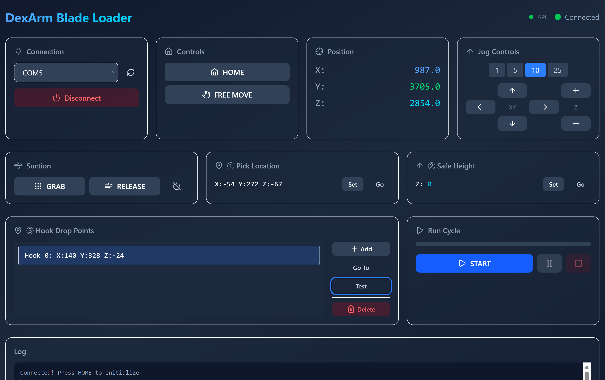

# DexArm Blade Loader

A modern web-based teach-and-replay pick-and-place system for loading razor blades onto coating racks using the Rotrics DexArm robot arm.



## Architecture

- **Backend**: Python FastAPI server handling DexArm serial communication
- **Frontend**: React + Vite + Tailwind CSS for a modern, responsive UI

## Quick Start

### 1. Start the Backend

```bash
cd backend
pip install -r requirements.txt
python main.py
```

The API server will start on `http://localhost:8000`

### 2. Start the Frontend

```bash
cd frontend
npm install
npm run dev
```

Open `http://localhost:5173` in your browser.

## How to Use

### 1. Connect

- Select the correct COM port from the dropdown
- Click **Connect**
- The arm will be set to Pneumatic module (suction cup) automatically

### 2. Home the Arm

- Click **HOME** to initialize the arm position

### 3. Teach Pick Position

- Use **Jog Controls** or **FREE MOVE** to position the arm
- Click **Set** in the Pick Location card

### 4. Set Safe Height

- Jog to a safe Z height (clearance for moves)
- Click **Set** in the Safe Height card

### 5. Teach Hook Positions

For each hook on your rack:

1. Position the arm above the hook
2. Click **Add** in Hook Drop Points
3. Repeat for all hooks

### 6. Run Cycle

- Click **START** to begin the pick-and-place cycle
- Use **Pause** to temporarily stop
- Use **Stop** to abort

## API Endpoints

| Endpoint | Method | Description |
|----------|--------|-------------|
| `/api/ports` | GET | List available serial ports |
| `/api/status` | GET | Get current status and positions |
| `/api/connect` | POST | Connect to DexArm |
| `/api/disconnect` | POST | Disconnect |
| `/api/home` | POST | Move to home position |
| `/api/jog` | POST | Jog the arm |
| `/api/pick/set` | POST | Set pick location |
| `/api/safe-z/set` | POST | Set safe height |
| `/api/hooks/add` | POST | Add hook position |
| `/api/cycle/start` | POST | Start pick-and-place cycle |

## Files

```text
dexarm-blade-loader/
├── backend/
│   ├── main.py              # FastAPI server
│   ├── dexarm_controller.py # Core DexArm control
│   ├── requirements.txt     # Python dependencies
│   └── blade_positions.json # Saved positions (auto-created)
├── frontend/
│   ├── src/
│   │   ├── App.tsx          # Main UI component
│   │   ├── hooks/useApi.ts  # API hook
│   │   └── lib/utils.ts     # Utilities
│   └── package.json
└── README.md
```

## Requirements

- Python 3.8+
- Node.js 18+
- DexArm with Pneumatic module

## G-Code Reference

| Command | Description |
|---------|-------------|
| `M888 P2` | Set pneumatic module |
| `M1112` | Go home |
| `G1 F2000 X_ Y_ Z_` | Move to position |
| `M1000` | Suction ON |
| `M1002` | Release air |
| `M1003` | Pump off |
| `M84` | Disable motors (free move) |
| `M17` | Enable motors (lock) |
| `M893` | Read encoder position |
